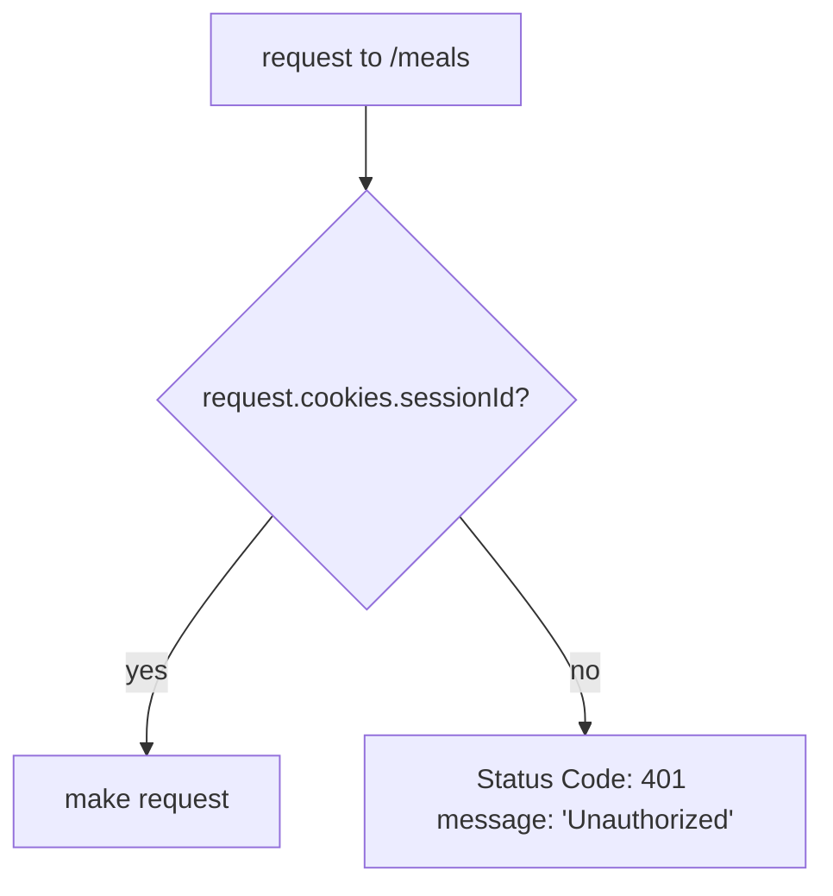

<h1 align="center">
  
</h1>

<p align="center">
  
  
  
  
  
  
</p>

## 💻 Projeto

  Esse projeto é uma API REST, onde podemos gerenciar dietas. Podendo cadastrar um usuário que poderá:
- Cadastrar suas refeições dizendo se estará ou não dentro da sua dieta;
- Recuperar uma lista com todas suas refeições;
- Recuperar apenas uma refeição;
- Editar as informações de uma refeição;
- Deletar uma refeição cadastrada;
- Obter um resumo do seu progresso que trará as seguintes informações:
  - Total de refeições cadastradas;
  - Total de refeições dentro da dieta;
  - Total de refeições fora da dieta;
  - Melhor sequência de refeições dentro da dieta;

## 🧐 Diagramas

### Funcionamento das requisições
```mermaid
sequenceDiagram
    participant client
    participant /users
    participant /meals
    participant database
    client->>/users: (POST) body: { name, email }
    /users->>database: { id, name, email }
    client->>/meals: (GET) cookies: { sessionId }
    /meals->>database: request meals where user_id = sessionId
    database->>/meals: [{ id, user_id, name, description, is_diet, created_at }, ...]
    /meals->>client: { meals: [{ id, name, description, is_diet, created_at }, ...] }
    client->>/meals: (GET) param: { mealId }, cookies: { sessionId }
    /meals->>database: request meals where user_id = sessionId and id = mealId
    database->>/meals: { id, user_id, name, description, is_diet, created_at }
    /meals->>client: { meal: { id, name, description, is_diet, created_at } }
    client->>/meals: (GET) path: /summary, cookies: { sessionId }
    /meals->>database: request meals where user_id = sessionId
    database->>/meals: [{ id, user_id, name, description, is_diet, created_at }, ...]
    /meals->>client: { totalMeals, totalDietMeals, totalCheatMeals, bestSequence }
    client->>/meals: (POST) cookies: { sessionId }, body: { name, description, isDiet }
    /meals->>database: { id, user_id, name, description, is_diet }
    client->>/meals: (PUT) cookies: { sessionId }, body: { name, description, isDiet }, param: { mealId }
    /meals->>database: update meals where user_id = sessionId and id = mealId
    client->>/meals: (DELETE) cookies: { sessionId }, param: { mealId }
    /meals->>database: delete meals where user_id = sessionId and id = mealId
```

### Sistema de autorização


## 💻 Tecnologias

Para a realização desse projeto foi utilizado o microframework [Fastify](https://fastify.dev/) assim foi possível cadastrar rotas e utilizar o potencial de seus plugins. A escolha do Fastify no lugar do Express foi devido ao seu desempenho, baixa sobrecarga, suporte a async/await e ecosistema em crescente. Além do Fastify, também instalamos o `@fastify/cookie` pela simplicidade de trabalhar com cookies em um sistema Fastify. O [zod](https://zod.dev/) foi a escolha para lidar com validações de dados, essa escolha se deu por ter uma ótima integração com TypeScript, deixando o trabalho mais eficiênte. Já para lidar com consultas ao banco de dados foi utilizado o query builder [knexjs](https://knexjs.org/), dessa forma podemos deixar a sintaxe mais próxima das querys dos banco de dados, com uma simplicidade comparada a um ORM.

## ✍️ Instrução

### Pré configuração.
>Para executar esse projeto será necessário ter o [node](https://nodejs.org/en) e [yarn](https://yarnpkg.com/) instalados, de preferência para as versões apresentadas nas tags do início desse readme.

>Para conseguir transitar bem entre as versões sugiro o uso do [nvm](https://github.com/nvm-sh/nvm)

### Configuração
>Após acessar o diretório do projeto, crie seu arquivo `.env` na raiz do projeto seguindo o arquivo `.env.example`.

Agora você deve executar os seguintes passos no seu terminal:
```bash
# instalação dos pacotes
$ yarn

# Execução das migrations
$ yarn run knex -- migrate:latest

# execução do servidor
$ yarn dev
```

Agora você poderá testar com a utilização de uma ferramenta como por exemplo: [insomnia](https://insomnia.rest/) ou [postman](https://www.postman.com/)